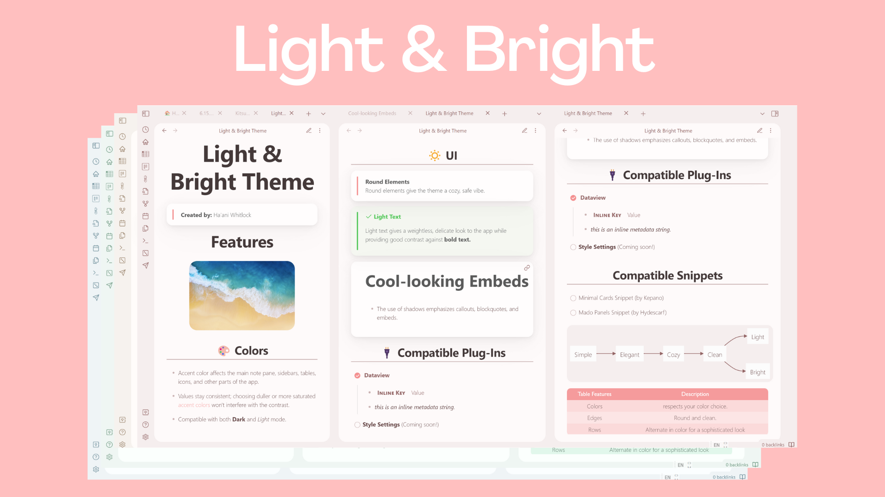
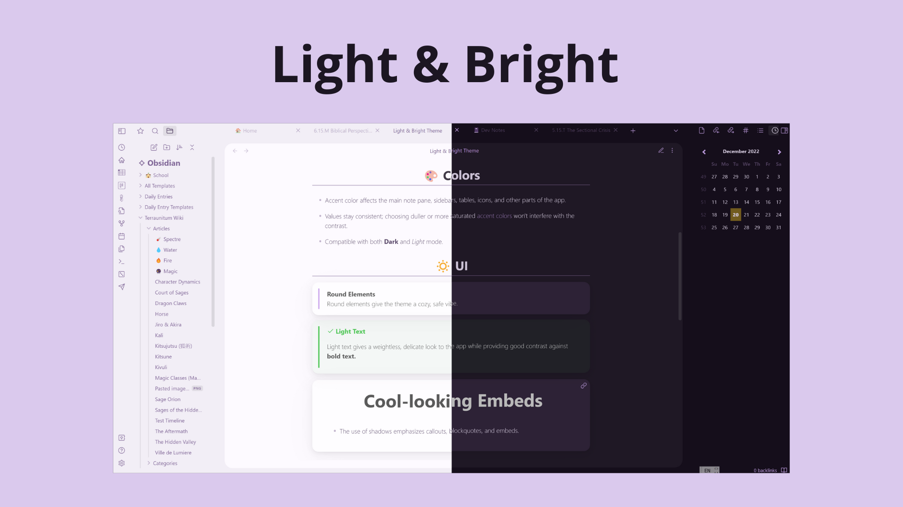

A clean, weightless theme created to evoke an elegant, modern, cozy feel. This theme was heavily inspired by hydescarf's Mado Miniflow Theme and the Ultra Lobster Theme by kneecaps.

# Features

## 🎨 Color
- Respects your color choices.
  - Accent color affects sidebars, the main note pane, and more.
- Stays Consistent
  - Values stay the same, regardless of whether you choose a dull or intense accent color. No interference with contrast.
- Easy on the eyes in both *light* and **dark** mode.

## 🎩 Style
- Various elements have been rounded for a cleaner, more cozy feel.
- Box shadows give depth to certain elements.
- Header sizes increase more by level, making each one easily distinguishable.
- Centered headers.

# 🔌Compatible Plug-Ins
- [x] Dataview
- [ ] Style Settings *(coming soon!)*
# ✂️ Compatible Snippets
- [x] Built-In support for Kepano's Minimal **cards** CSS class.

# Credits
- ⭐ hydescarf's Mado Miniflow theme
  - used code to round the main note pane
  - inspiration
- ⭐ kepano's Minimal theme
  - cards CSS class
- ⭐ kneecaps' Ultra Lobster Theme
  - inspiration

